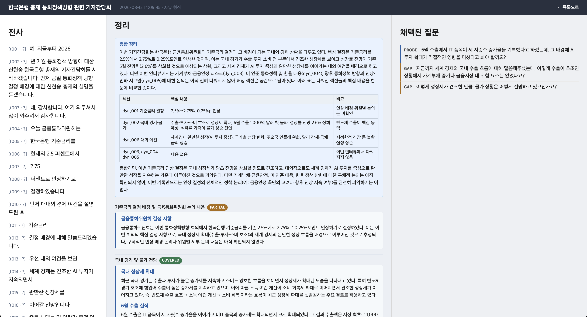

# Ainterview Assistant

> 전문가 인터뷰를 실시간으로 **전사 → 구조화 → 추천 질문**까지 이어주는 개인용 로컬 도구


인터뷰가 진행되는 동안 배경에서 계속 지식 구조를 다시 정리해나가고, 인터뷰어가 원할 때 그 시점 맥락 기반의 후속 질문 후보를 즉석에서 생성해줍니다. **도메인 무관** — 대상 분야는 코드가 아니라 세션별로 주입하는 인터뷰 스키마(JSON)가 결정합니다. 금융이든 요리든 의료든, 스키마만 갈아끼우면 됩니다(스키마 없이 자유 형식으로도 진행 가능).

## 목차

- [스크린샷](#스크린샷)
- [주요 기능](#주요-기능)
- [기술 스택](#기술-스택)
- [시작하기](#시작하기)
- [폴더 구조](#폴더-구조)
- [설계 원칙](#설계-원칙)
- [라이선스](#라이선스)

## 스크린샷



진행 중인 인터뷰 화면. 왼쪽은 실시간 전사, 가운데는 배경에서 계속 재종합되는 구조화 정리(종합 개요 + 섹션별 요약, 다뤄진 정도에 따라 상태 배지 표시), 오른쪽은 트리거 시 생성되는 추천 질문 카드와 채택된 질문 목록입니다.

## 주요 기능

- **실시간 전사** — 오디오 파일 배치 STT 또는 실시간 마이크 스트리밍(Deepgram) 중 선택
- **실시간 구조화** — 사용자가 고른 주기마다 지금까지의 전체 맥락을 다시 참고해 지식 구조를 재작성(단순 누적이 아니라 계속 다듬어지는 문서)
- **추천 질문 생성** — 버튼으로 즉석 생성하거나, "지금이 물어볼 때인가"를 배경에서 정성적으로 판단해 자동으로 제안
- **모순 감지 및 해소 추적** — 인터뷰 중 서로 어긋나는 발언을 잡아내고, 뒤에 나온 발언으로 해소되면 자동으로 갱신
- **전사 오인식 교정** — 뒤 문맥으로 미뤄봤을 때 STT가 잘못 받아적었다고 강하게 확신되는 부분만 보수적으로 교정
- **인터뷰 종료 시 종합 정리 문서 작성** — 표·헤딩 등을 활용한 마크다운 문서로 마지막 다듬기
- **채택/편집 로그** — 어떤 질문을 실제로 물었는지, 어떻게 수정해서 물었는지 기록
- **도메인 무관** — 스키마 JSON으로 대상 분야 결정, 스키마 없이 자유 형식 진행도 가능

## 기술 스택

- **언어/런타임**: Python 3.11+
- **웹 UI**: Flask, 서버 렌더링(Jinja2), 순수 폼 기반 — 필요한 두 곳(추천 질문 생성, 채택)만 최소한의 fetch 사용
- **LLM**: [OpenRouter](https://openrouter.ai)를 통한 Claude 호출 — 용도별로 모델 이원화(판단/짧은 재작성은 Haiku, 지식 구조를 만들거나 통째로 다시 쓰는 호출은 Sonnet)
- **STT**: [Deepgram](https://deepgram.com) (배치 + 실시간 스트리밍, 한국어)
- **저장**: 로컬 파일(JSON/JSONL) — 별도 DB 없음

## 시작하기

```bash
python -m venv .venv
source .venv/bin/activate
pip install -e ".[dev]"

cp .env.example .env
# OPENROUTER_API_KEY는 항상 필요합니다 — 구조화·질문생성 LLM 호출에 씀.
# 웹 화면에서 실제로 세션을 시작하려면 DEEPGRAM_API_KEY도 필요합니다 —
# 화면에서 고를 수 있는 입력 방식("오디오 파일 테스트"/"실시간 마이크") 둘 다
# Deepgram STT를 씁니다.

python scripts/run_app.py
# http://127.0.0.1:5001 접속 후 인터뷰 스키마(선택)와 입력 방식을 고르고 세션 시작
```

테스트는 실제 LLM/STT 호출을 대부분 가짜로 대체해서 돌아가므로, API 키 없이도 실행됩니다:

```bash
pytest
```

## 폴더 구조

```
src/interview_assistant/
├── contracts.py       # 모든 모듈이 공유하는 데이터 계약 — 모듈끼리 서로의 내부를 몰라도 이걸로 통신
├── config.py           # 모델 선택 · 시간창 · 임계값 등 튜닝 상수
├── sources/             # 전사 입력 (TranscriptSource: fixture 재생 / 오디오 파일 배치 STT / 실시간 마이크 STT)
├── structurer/          # 전사 → 지식 구조 (실시간 재종합, 초기 목차 제안, 전사 오인식 교정, 최종 정리)
├── question_engine/     # 지식 구조 → 추천 질문 (생성 + "지금이 물어볼 때인가" 배경 판단)
├── storage/             # 세션 로그 · 채택 로그 · 구조화 결과를 로컬 파일(JSON/JSONL)로 저장
└── app/                 # Flask 웹 UI — 위 모듈들을 배선하는 곳
scripts/                 # 웹 서버 진입점, STT 벤더 비교 도구
schemas/                 # 사용자가 관리하는 인터뷰 스키마 JSON
assets/                  # README용 스크린샷 등
audio/                   # 오디오 파일 테스트용 파일 — 로컬 전용, git에는 안 올라감
sessions/                # 세션마다 자동 생성되는 결과(전사·구조화·채택 로그) — 개인 데이터라 git에는 안 올라감
```

## 설계 원칙

- **모듈 독립성** — 모든 통신은 `contracts.py`의 데이터 타입으로만. 어떤 모듈도 다른 모듈의 내부를 직접 import하지 않습니다.
- **STT 디커플링** — 전사 입력은 `TranscriptSource` 인터페이스 뒤에 있어, STT 없이도 fixture 재생만으로 하류 전체를 개발·테스트할 수 있습니다.
- **풀(pull) 방식** — 추천 질문은 AI가 대화에 끼어드는 게 아니라, 인터뷰어가 트리거(버튼 또는 배경 판단 통과)했을 때만 표출됩니다.
- **개인용·로컬 전용** — 단일 사용자, 맥북 로컬 실행을 전제로 합니다. 서버/멀티유저/인증은 범위 밖입니다.

## 라이선스

[MIT](LICENSE)
